# Spec-Driven Workflow

Keep AI coding agents on rails. Every change starts from a written spec with testable acceptance
criteria, gets a design that two reviewer agents have argued with, and **cannot be marked done** until
the criteria are ticked and the evidence is recorded — enforced by git hooks, not good intentions.

The whole workflow is **agent-agnostic** and packaged to be compiled by
[Microsoft APM](https://microsoft.github.io/apm/) (Agent Package Manager) into whichever coding-agent
harness your project uses — `.claude/`, `.opencode/`, `.cursor/`, `.github/`, … A static website and a
complex information-management system use the **exact same workflow**. Stack- and design-specific
guidance is optional and lives in separate injectable [bundles](docs/extending-with-bundles.md); *where* your
governing context lives — architecture, security rules, ADRs, UX — is likewise pluggable, through a
[context map](docs/extending-with-bundles.md) of files and optional MCP providers.

## The loop

One spec per unit of work. A spec is a **folder** — `specs/SPEC-N-name/` holding `spec.md` (the
contract), `tech-design.md` (the how), `audit-trail.md` (the verification record), and any attachments
the spec refers to (mockups, imported source). Each step advances that spec's **status**, which must
stay identical in `spec.md` and in `specs/INDEX.md` — the hooks fail your commit if they drift.

| What happens | You run | Status becomes |
|---|---|---|
| Define **what** — user stories, acceptance criteria, edge cases, BDD scenarios | `/requirements <your idea>` | 🔵 In Planning |
| Design **how** — schema, API contracts, components | `/technical-design SPEC-1` | 🟣 Planned |
| Two rounds of independent architecture + security review | *(automatic)* | 🟣 Planned |
| Build it, on the spec's branch | — | 🟡 In Progress |
| Prove it against the acceptance criteria and BDD scenarios | `/write-tests SPEC-1` | 🟠 In Review |
| Tick every criterion, record the test evidence | — | 🟢 Validated |



A spec whose feature no longer exists becomes ⚫ Deprecated and stays as a tombstone — dropped, never
rewritten, so the history stays traceable. Every spec is versioned with an inline changelog, so you can
see *why* it changed and which other spec forced it.

📄 **[See a finished spec](docs/example-spec.md)** — one worked example, `Validated` and closed out,
showing the status header, changelog, ticked acceptance criteria, a descoped one, BDD scenarios, and the tech design.

## What you get

- **`specs/INDEX.md`** — one table with every spec's status, version, folder, and the recommended build
  order, kept in lockstep with the specs themselves.
- **Slash commands** — `/requirements`, `/technical-design`, `/write-tests`, `/frontend-architecture`.
- **Reviewer agents** — `architecture-reviewer`, `security-reviewer`, driving the Plan Review Workflow.
  Pick a model per agent (any model your harness understands, including local ones) — see
  *Choosing models for the reviewer agents*.
- **Security rules** — auto-injected when you touch `.env*` or `**/api/**`, from wherever your context
  map points (`kind=security`; defaults to `docs/SECURITY-RULES.md`).
- **General engineering rules** — `engineering-practices` (discovery before assumption, KISS/DRY/YAGNI,
  what not to introduce), `code-hygiene` (no zombie code; docs and your architecture source kept true), and
  `testing` (universal, stack-agnostic testing law). These are the rules you would otherwise hand-write
  into `CLAUDE.md` / `AGENTS.md`; here they ship as managed rules that refresh on `apm update`.
- **Self-enforcing checks** — spec status, acceptance-criteria close-out, spec versioning, and
  unanswered questions are enforced two ways (see *Enforcement* below).
- **An unattended mode** — the commands can write their questions into the spec instead of asking the
  terminal, and the next phase stays locked until you answer. See *Running unattended*.

What it deliberately does **not** contain: language/framework/design specifics (those live in
optional bundles, discovered through a frozen profile extension point), or any hardcoded assumption
about *where* your governing context lives — architecture docs, security rules, ADRs, and UX
guidelines are located through the context map, so they can sit in the repo or in Confluence/Notion/an
MCP provider.

## Requirements

- [APM](https://microsoft.github.io/apm/) installed (`apm --version`).
- `git` (for the enforcement floor).
- `jq` — **required**. The project config (`.spec-workflow/config.json`) is JSON, and `jq` is what
  reads and writes it and merges agent hooks safely. The setup script checks for it up front and
  stops before touching anything if it's missing.

## Install (two steps)

APM deploys the shared primitives automatically, but — by design — it does **not** run a
dependency's setup script in your project (that would be a supply-chain footgun). So setup is an
explicit second step you can read before running.

**1. Install the primitives.** Pin by **immutable commit SHA** (not a floating tag) so installs are
reproducible and can't be silently moved under you:

```bash
apm install mode41/sd-workflow#<commit-sha>
```

This deploys the rules, commands, and reviewer agents to **whichever harness markers your repo has** —
`.claude/`, `.opencode/`, `.cursor/`, `.github/`, … (auto-detected; nothing pinned). Verified:
instructions → each harness's rules dir, commands → its commands dir, agents → its agents dir.

**2. Run the one-time setup** (idempotent; re-run after every `apm update`). Read it first if you
like — it's short, does **no** network access, and shells out to nothing but `git` and `jq`:

```bash
bash "$(find apm_modules -path '*/.apm/scripts/init-and-wire.sh' | head -1)"
```

This:
- deploys the enforcement machinery into a committed `.spec-workflow/` directory,
- **seeds** the living files **only if absent** — `specs/INDEX.md`, `docs/PRD.md`,
  `docs/SECURITY-RULES.md`, `.spec-workflow/context-map.md`, `AGENTS.md`, `spec-workflow.supplemental.md`,
  `.spec-workflow/config.json` — never clobbering your data,
- **adopts an existing `AGENTS.md`**: if you already have one (most existing projects do), the
  installer never rewrites it — it offers to *append* a marked workflow section (interactively), or
  records it as a manual step if you decline or run non-interactively. Opt out with
  `touch .spec-workflow/.no-agents-merge`,
- merges the config forward (adds entries for newly-shipped reviewer agents, retires dropped ones)
  and prompts for any model you haven't chosen — see *Choosing models* below,
- wires `git config core.hooksPath` (detect-and-preserve — see below),
- reconciles each present harness's native hooks (today that means *removing* the Claude `Stop` hook
  older versions wired — see *Enforcement* below) and stamps each agent's configured model into the
  deployed agent files,
- writes **`.spec-workflow/MANUAL-STEPS.md`** — a regenerated checklist of everything the installer
  could *not* do for you (an existing `AGENTS.md` to extend, a foreign `core.hooksPath` to chain, an
  unsupported harness, etc.). Check the file after each run; resolved items drop off automatically.

Update later with `apm update`, then re-run the step-2 command: managed primitives and templates
refresh; your seeded living files are left untouched (a drift notice prints if your
`docs/SECURITY-RULES.md` diverges from upstream), and `.spec-workflow/MANUAL-STEPS.md` is
regenerated. In CI, use `apm install --frozen` and run `apm audit`.

> **Verified against APM 0.25.0.** Auto-detect deploy works; a dependency's `lifecycle:` block is
> project-scoped and does **not** auto-run in a consumer (hence the explicit step 2); project
> lifecycle scripts are **untrusted by default** (`apm lifecycle trust` required) and executable
> primitives are gated by `apm approve` — so nothing of ours runs without your explicit action.

## Start here

In your coding agent, not the shell:

```
/requirements a CLI that converts CSV files to Parquet
```

That interviews you about the project, fills in `docs/PRD.md`, and splits the work into
`specs/SPEC-N-name/` folders (each with a `spec.md`) with a recommended build order. Then, per spec:

```
/technical-design SPEC-1     → design reviewed by both reviewer agents, written as tech-design.md
                             → implement it on the spec's branch
/write-tests SPEC-1          → tests written and run against the acceptance criteria and BDD scenarios
                             → tick the criteria, record the evidence in audit-trail.md, done
```

Adding a feature to a project that already has a PRD? Same entry point — `/requirements <the feature>`
adds a single spec instead of bootstrapping everything.

Not sure what you're aiming at? [`docs/example-spec.md`](docs/example-spec.md) is a complete spec at
the end of that journey, annotated with which hook enforces which convention.

## Deployed layout (in your project)

```
.spec-workflow/            # this package's namespace — commit this. Mixed: most of it is managed
                           # (refreshed every install), the files marked ← YOURS are seeded once.
  hooks/                   #   managed: check-*.sh, pre-commit, checks.sha256 (the git enforcement)
  templates/               #   managed: current spec/INDEX/PRD/context-map/audit-trail templates (migration reference)
  checks.spec.json         #   managed: neutral metadata for the checks (where they live)
  config.schema.json       #   managed: describes config.json (drives editor validation)
  config.json              #   ← YOURS. Seeded once; values never overwritten. See below.
  context-map.md           #   ← YOURS. Seeded once — where governing context lives
                           #     (files + optional MCP providers). Never clobbered.
  profiles/                #   optional, owned by a stack/design bundle if you install one:
    stack.md               #     stack specifics  (consumed by /write-tests, /technical-design)
    design.md              #     design specifics (consumed by /frontend-architecture)
  MANUAL-STEPS.md          #   generated per-machine checklist of what the installer couldn't do
                           #   (git-ignored via a managed .spec-workflow/.gitignore — don't commit)
specs/                     # your specs (SPEC-N-name/ folders) + INDEX.md   ← living data, seeded once
                           #   each folder: spec.md + tech-design.md + audit-trail.md + attachments
                           #   a parked spec may sit under specs/backlog/SPEC-N-name/ instead
docs/PRD.md                # living data, seeded once (default `business` context source)
docs/SECURITY-RULES.md     # living data, seeded once (default `security` source; drift-notified on update)
ARCHITECTURE.md            # optional — default `architecture` source (create as the project takes shape)
AGENTS.md                  # neutral project memory, seeded once (or workflow section appended if it exists)
spec-workflow.supplemental.md  # your workflow tuning, seeded once, never overwritten
.claude/ .opencode/ ...    # APM-deployed rules/commands/agents + our agent-model stamps
```

## Enforcement — what runs where

The five checks (`check-ac-closeout`, `check-bdd-closeout`, `check-status-sync`, `check-spec-version`,
`check-open-questions`) run at **one** boundary: the **git pre-commit hook**. It works for any agent
(or none), because it's git, not an agent feature — and a commit is a real workflow boundary.

It runs whatever `check-*.sh` the installer deployed — there is no list to keep in sync, and a check a
newer version drops is pruned rather than left behind. A spec parked under
`specs/backlog/SPEC-N-name/` is held to all five checks, exactly like one in the main tree.

**Why there is no session-end hook.** Earlier versions also merged the checks into Claude Code's
`Stop` hook, calling it a "finish boundary". It isn't one: `Stop` fires when the agent finishes
responding — the end of *every* turn, including one that only answered a question or talked through an
open `Q-N`. No harness exposes a "the next workflow step was invoked" event. Worse, a `Stop` hook that
exits 2 doesn't warn — it *blocks the agent from stopping* and feeds stderr back as an instruction to
continue, so an ordinary conversational turn became a forced continuation. The wiring is gone, and
`apm install` removes it from projects that still have it. The check scripts additionally honor the
harness's `stop_hook_active` flag, so a stale hook left over anywhere can't loop.

Known, accepted asymmetries — documented, not hidden:

- **`git commit --no-verify` bypasses the git gate.** It is the only enforcement layer, so a bypassed
  commit is unchecked.
- **`core.hooksPath` is per-clone.** `git clone` does **not** copy `.git/config`, so a fresh clone has
  no git enforcement until someone re-runs `apm install`. (The `.spec-workflow/` scripts are
  committed and travel with the repo; only the *activation* is local.)
- **`core.hooksPath` detect-and-preserve.** If your repo already sets `core.hooksPath` (Husky,
  lefthook, an org secret-scanner), the installer will **not** overwrite it — it warns and prints how
  to chain the spec-workflow checks from your existing hook. Opt out permanently with
  `touch .spec-workflow/.no-git-hooks`.

### Testing the enforcement machinery

The checks are the part of this package that can silently break a consumer's workflow, so they have a
behavioural test suite. It runs the **shipped** scripts in `.apm/scripts/` against throwaway git
fixtures in a temp dir — nothing is installed and your repo is untouched:

```bash
bash tests/enforcement.test.sh     # exit 0 = all passed
```

It covers the status / AC / open-question state machine, the spec-versioning substantive-change rules
and every documented exemption, the `stop_hook_active` safety net, the `pre-commit` wrapper (blocking,
`--no-verify`, and the `checks.sha256` integrity gate), and the installer's hook reconciliation and
retired-file pruning. Only `git` and `bash` are needed; the sections that need `jq` skip themselves
without it. This is repo-only tooling — it lives outside `.apm/`, so it is never packed or deployed.

Run it before publishing a version. If you change a check's behaviour on purpose, update the matching
assertion in the same commit — an assertion that no longer describes the intended contract is worse
than no assertion.

## Running unattended

`/requirements` and `/technical-design` are written to interview you, which is useless when nobody is
at the terminal. Flip one key in `.spec-workflow/config.json`:

```json
{ "interaction": { "mode": "file" } }
```

Now a command that would have asked instead **writes the question into the file it owns**, records the
answer it assumed, and keeps going — so an unattended run finishes with a real PRD, real specs, and a
written list of everything it had to decide for you:

```markdown
## Open Questions

### Q-1: Which compression codec is the default?
- (a) snappy — faster writes, ~30% larger files
- (b) zstd — ~2× slower, ~50% smaller
**Assumed:** (b) zstd — AC-2 prioritises storage cost over write latency.
**Answer:**
```

You answer by filling in `**Answer:**` — your choice, or `confirmed` to accept the assumption.

**Nothing built on a guess can move forward.** An empty `**Answer:**` is a ceiling on the spec's
status, enforced by `check-open-questions.sh` at the same pre-commit gate as every other check:

| An unanswered question in | holds the spec at |
|---|---|
| `docs/PRD.md` | 🔵 In Planning — for **every** spec, since project-level questions invalidate anything beneath them |
| `specs/SPEC-N-*/spec.md` | 🔵 In Planning — so `/technical-design` refuses the spec |
| `specs/SPEC-N-*/tech-design.md` | 🟣 Planned — so implementation cannot start |

Two details worth knowing:

- **The ledger is not a queue.** Answered questions stay in the file, so `## Open Questions` becomes
  the record of *why* a decision went the way it did — the one thing the format previously threw away.
  Editing it never demands a version bump; whatever the answer then *changes* in the contract does.
- **It works in `ask` mode too.** The check does not care how a question got there, so you can park a
  spec by hand by dropping a `Q-N` into it. Unresolved critical findings from the plan-review pipeline
  land here as well, which means "accept this risk" has to be written down by a human rather than
  agreed to in a chat window that nobody keeps.

## Choosing models for the reviewer agents

`.spec-workflow/config.json` decides which model each reviewer subagent runs on:

```json
{
  "$schema": "./config.schema.json",
  "schemaVersion": 2,
  "interaction": { "mode": "ask" },
  "agents": {
    "architecture-reviewer": { "model": { "default": "opus" } },
    "security-reviewer":     { "model": { "claude": "sonnet", "opencode": "ollama/qwen2.5-coder" } }
  }
}
```

- **Values are written verbatim** into the deployed agent file's `model:` frontmatter — the package
  never translates them, so any model your harness understands works, local ones included
  (`ollama/qwen2.5-coder`, `devstral`, …).
- **`default`** covers every harness without its own key; add a per-harness key only where they differ.
- **Omit a model** (or set it to `null`) and that agent just inherits the harness default.
- The setup script **prompts** for anything unset when run interactively, and simply leaves it unset
  in CI or with no TTY — `apm install --frozen` never blocks. Re-run with `SPEC_WORKFLOW_CONFIGURE=1`
  to change your answers, or edit the JSON directly (the `$schema` pointer gives you editor
  validation and completion).

**Stamped today:** Claude Code (`.claude/agents/`) and opencode (`.opencode/agents/`). Copilot's
`model:` is a list of UI display names and Codex agents are TOML without a model field, so those
harnesses are reported as unsupported and their agents inherit the harness default.

**Why step 2 re-runs every time:** `apm update` overwrites the deployed agent files, so the setup
command re-applies your models afterwards. That is also why your choices live in `config.json` rather
than in the agent files themselves.

Your settings survive package updates: when a new version adds a reviewer agent, its entry is added
(and prompted for) with your existing values untouched; when one is dropped, its entry moves to
`retiredAgents` rather than being deleted, and is restored if the agent ever returns. When a new
version changes the config *format*, the setup script migrates `schemaVersion` forward additively —
new keys get their defaults, nothing you set is touched. Going the other way, a config newer than the
installed package makes it skip model stamping and tell you to update, rather than mis-parse your
settings.

## Security notes (read before first install)

- **Setup runs no code without your action.** Unlike npm-style postinstall hooks, APM does **not**
  auto-run a dependency's script in your project — you invoke the step-2 bootstrap explicitly, it is
  short, and it does **no** network access (it shells out only to `git` and `jq`), so you can read
  `.apm/scripts/init-and-wire.sh` (or `apm_modules/.../init-and-wire.sh`) before running it. If you
  ever add it to your own `apm.yml` `lifecycle:` block, APM keeps it **untrusted until you run
  `apm lifecycle trust`**. Still: pin by commit SHA, and use `--frozen` + `apm audit` in CI.
- **`docs/SECURITY-RULES.md` is yours.** It is seeded once and never overwritten, so org-specific
  rules survive updates; the installer prints a drift notice when it diverges from upstream so you can
  pull in improvements deliberately. It is the **default** `security` source — repoint `kind=security`
  in `.spec-workflow/context-map.md` at a Confluence/Notion page or an MCP provider if your rules live there
  instead.
- **Check-script integrity.** The pre-commit hook verifies every deployed check script against a
  pinned `checks.sha256` before running them, and fails loudly if one was tampered with. The installer
  also prunes checks a newer version no longer ships, so a dropped check cannot linger and get
  re-blessed by the regenerated hash.

## Extending with stack/design bundles

The core is bundle-ready via a **frozen profile extension point**: `/write-tests` and
`/technical-design` consult `.spec-workflow/profiles/stack.md`; `/frontend-architecture` consults
`.spec-workflow/profiles/design.md`. If no profile is present, commands run on discovery of your
project's own patterns. See [`docs/extending-with-bundles.md`](docs/extending-with-bundles.md).

*Frozen* describes the contract's shape — fixed paths, a closed `kind` vocabulary, schema-versioned
files — not the release. The package is **pre-1.0** (`0.MINOR.PATCH`), so until a stable major exists a
breaking change bumps the minor. Pin by commit SHA and read the diff before updating.

## Connecting governing context (files & MCP providers)

The workflow reads your project's governing context — architecture, security rules, business context,
ADRs, UX guidelines — through a single seeded manifest, `.spec-workflow/context-map.md`. Each entry is
either a **file** (a repo path, resolved from the repo root, or an external URL — Confluence, Notion, a
wiki) or a **provider**: an MCP tool
that serves context **scoped** to the part of the system you are working on, queried live. For any
kind, the commands query a connected provider, else read the listed file, else discover from the repo —
so it degrades cleanly and needs **no new dependency** (the manifest is plain markdown; MCP is
optional). Architecture docs and security rules are located this way too, so they can live in the repo
or in an org-wide tool — your choice, not a hardcoded path.

The extension point is vendor-neutral: any MCP tool matching the contract works. The reference
provider is **[architrace.io](https://architrace.io)**, which serves your org's governing context
(Confluence, Notion, git, …) scoped to each system. Connect its MCP server in your harness settings
and add a row to the manifest's Providers table. See
[`docs/extending-with-bundles.md`](docs/extending-with-bundles.md) for the frozen contract.

## License

MIT — see [LICENSE](LICENSE).
